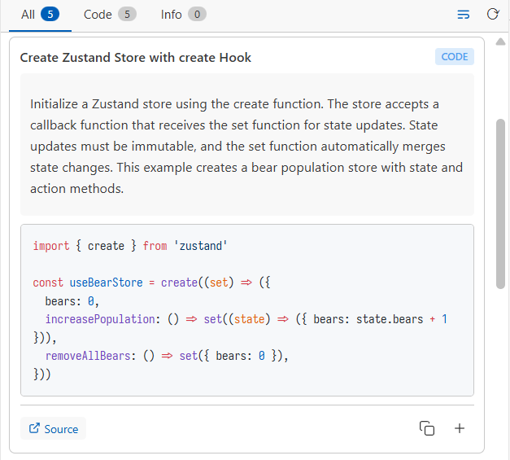

# Context7 Docs (For Human)

[English](README.md) | [中文](README.zh-CN.md)

[](https://code.visualstudio.com/)
[](https://opensource.org/licenses/MIT)

使用 Context7 在 VS Code 中直接查询文档、代码示例和 API 说明。



> (眼馋 AI 的 Context7.. 终于人也能用了！)

## ✨ 特性

- **开箱即用** - 无需任何配置即可使用（通过 MCP 匿名访问）
- **智能库检测** - 通过 LSP 自动识别代码所属库 (支持 10+ 语言)
- **历史记录** - 自动记录查询历史
- **语法高亮** - 渲染代码块和 markdown，可选自动换行
- **安全存储** - 使用 VS Code SecretStorage 安全存储 API Key
- **结果缓存** - 缓存加速重复搜索
- **库管理** - 添加、编辑、删除自定义库

## 🚀 快速开始

**选中搜索：**

- 选中代码
- 右键 → "Context7: Search Selection"
- 自动识别代码所属库，获取相关文档

**使用命令面板：**

- 使用 `Context7: Search Documentation` 命令
- 选择要查询文档的库
- 输入查询内容

## 📋 命令

| 命令                             | 说明                   |
| -------------------------------- | ---------------------- |
| `Context7: Search Documentation` | 搜索指定库的文档       |
| `Context7: Manage Libraries`     | 管理已保存的库         |
| `Context7: Search Selection`     | 智能搜索（自动识别库） |
| `Context7: Configure API Key`    | 设置 API Key（可选）   |

## ⚙️ 配置

通过 VS Code 设置（`settings.json`）自定义：

### 库列表

```json
{
  "context7.libraries": [
    { "id": "/websites/react_dev", "name": "react" },
    { "id": "/vuejs/vue", "name": "vue" }
  ]
}
```

### 路径模式

添加自定义模式从文件路径提取库名：

```json
{
  "context7.pathPatterns": [
    {
      "languages": ["javascript", "typescript"],
      "pattern": "my-monorepo/packages/([^/]+)"
    }
  ]
}
```

默认值：

```json
[
  {
    "languages": [
      "javascript",
      "typescript",
      "javascriptreact",
      "typescriptreact",
      "vue"
    ],
    "pattern": ".*node_modules/@types/([^/]+)"
  },
  {
    "languages": [
      "javascript",
      "typescript",
      "javascriptreact",
      "typescriptreact",
      "vue"
    ],
    "pattern": ".*node_modules/(@[^/]+/[^/]+|[^/]+)"
  },
  { "languages": ["python"], "pattern": ".*site-packages/([^/]+)" },
  { "languages": ["go"], "pattern": ".*pkg/mod/(.+)@" },
  { "languages": ["rust"], "pattern": ".*registry/src/[^/]+/(.+)-\\d+\\.\\d+" },
  { "languages": ["java"], "pattern": ".*\\.m2/repository/(.+/[^/]+)/\\d" },
  {
    "languages": ["java"],
    "pattern": ".*\\.gradle/caches/modules-\\d+/files-\\d+\\.\\d+/([^/]+/[^/]+)"
  },
  {
    "languages": ["csharp"],
    "pattern": ".*[/\\\\](?:\\.nuget/packages|packages)[/\\\\]([^/\\\\]+)"
  },
  { "languages": ["ruby"], "pattern": ".*gems/(.+)-\\d+\\.\\d+" },
  { "languages": ["php"], "pattern": ".*vendor/([^/]+/[^/]+)" },
  {
    "languages": ["dart"],
    "pattern": ".*(?:\\.pub-cache|Pub/Cache)/hosted/[^/]+/(.+)-\\d+\\.\\d+"
  }
]
```

用户模式会**优先于**默认模式匹配，可为特定项目结构自定义行为。

## 🔑 访问模式

|          | 匿名（默认） | API Key                                                              |
| -------- | ------------ | -------------------------------------------------------------------- |
| 速率限制 | 基于 IP      | 1,000/月（免费）                                                     |
| 配置     | 开箱即用     | 在 [context7.com/dashboard](https://context7.com/dashboard) 获取 Key |

## 🛠️ 开发

```bash
pnpm install        # 安装依赖
pnpm watch          # 开发模式
pnpm build          # 构建
pnpm test           # 运行测试
pnpm test:coverage  # 测试覆盖率
pnpm lint           # 代码检查
```

按 `F5` 启动扩展调试。

## 📐 架构

```
src/
├── extension.ts           # 入口
├── api/context7.ts        # Context7 API 客户端
├── services/
│   ├── LibraryService.ts  # 库管理
│   ├── SearchService.ts   # 搜索与高亮
│   └── SearchCache.ts     # 结果缓存
├── providers/
│   └── DocSearchViewProvider.ts  # Webview 提供者
├── utils/
│   └── libraryDetector.ts # LSP 库检测
└── constants/             # 配置
```

## License

MIT
